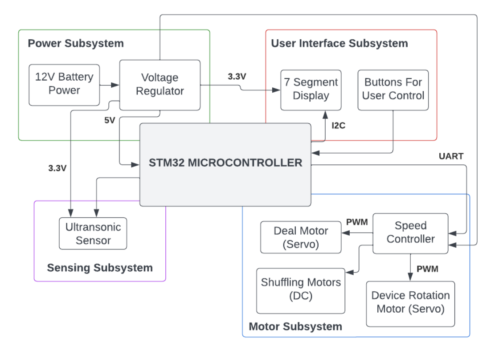
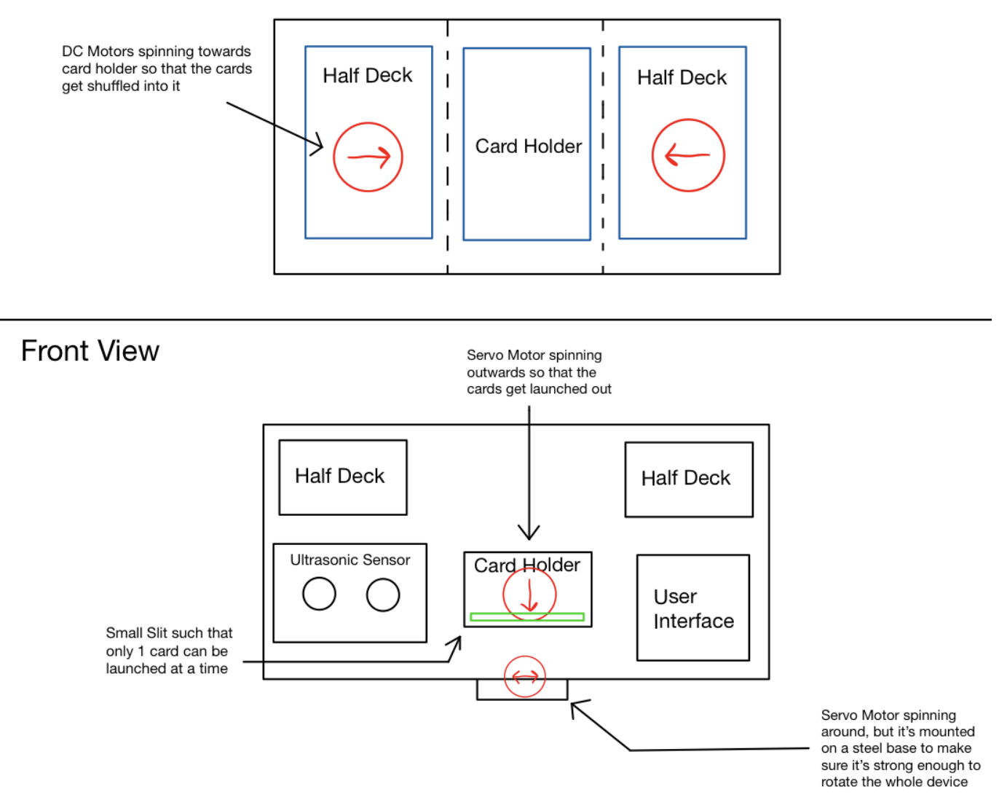

# 2/8/2023
# Objectives
- Complete Project Proposal

Today, our goal was to complete the project proposal. There were three main sections of the project proposal (introduction, design, and ethics/safety). I put most of my work into the design section, creating the bock diagram with the various subsystems and polishing the design choices. As a group we also disucssed and agreed upon a list of high level requirements then expanded upon and about each of them individually. We also discussed and collectively decided upon the subsystem requirements and the tolerance analysis risks. 

The high level requirements we decided upong were the following:

1. Shuffle a set of cards evenly

2. Distribute the cards to the players and Set up playing field

3. A functioning user interface with a display and buttons for parameter adjustment

The subysytem requirements we agreed upon:

Power Subsystem: 
- Must be battery powered and rechargeable
- Must provide a stable 12 ± 0.1V and support up to 2A of current drawn.
- Must contain 5V and 3.3V regulators (possibly 6V) to provide overcurrent/voltage, undervoltage, and short-circuit protection

User Interface Subsystem: 
- 7-Segment Display must be able to indicate number of players and game mode (by number)
- 7-Segment Display will communicate with microcontroller through I2C
- 7-Segment Display operation voltage must be 5V
- Must have buttons to change current game mode and number of players
- Must have buttons to initiate shuffle or deal process

Sensing Subsystem: 
- Ultrasonic sensor must be mounted on device such that the waves hit the people and bounce back
- Ultrasonic sensor must get accurate readings so that the device will know when to start/stop dealing cards
- We want to make sure that the ultrasonic sensor can get readings from at least 2 meters
- We want the measure angle for this sensor to be around 10-15 degrees wide which is typical for inexpensive ultrasonic sensors
- The operating voltage must be 5V

Motor Subsystem:
- Dealing and rotation servo motors must have an operating voltage of 4.8-6.0V
- Rotation servo motor must have enough torque (>60 oz-in) to rotate the device, 
- Rotation servo must be able to have at least 180 degrees of freedom
- Dealing servo motor needs at least 55.54 oz-in of torque in order to successfully launch a typical bicycle card (weighs roughly 100-150g)
- Shuffling DC motors must have an operating voltage of 12V
- Shuffling DC motor again must be able to output at least 40 oz-in of torque in order to shuffle the cards

Rohit also worked on a physical design diagram: 

