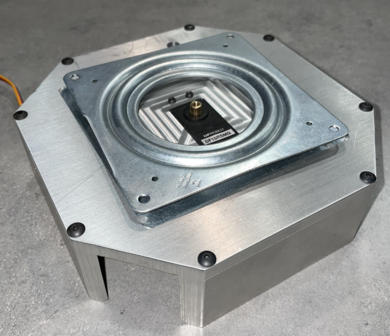

# 2/13/2023
# Objectives
- Met with Machine Shop for the first time

Today, we went to the machine shop and spoke with Greg to discuss how their team can go about making us the mechanical design we came up with last week. Greg said that creating the whole physical design we showed him was not feasible and that we needed to find another way to do it. We discussed possibly 3d printing the whole thing, but he brought up that for a device like that, 3d printing would make it fragile. After some discussion, Greg mentioned that we could use a metal component of a project they built for a team a few years ago with a base and a servo motor. 

Here is a picture of the servo motor and base they were offering to give us:

After the meeting, as a team, we talked about how feasible 3d printing would be and since rohit had some experience with it, we decided to attempt to 3d print the top.

