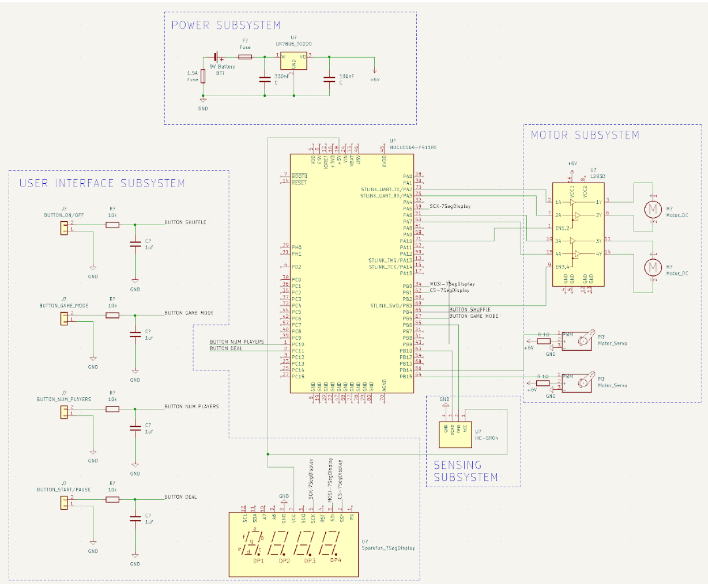

# 2/20/2023
# Objectives 
- Continue working on design document
- Again continue working on schematic and thinking about parts

Today we met up as a team to finish up the design document and make any schematic changes. The main sections we had to work on were requirements and verification and cost and scheduling. Ralph was in charge of completing the cost and scheduling section and helping Rohit and I out with the requirements and verification tables. 

I also continued working on the schematic.
Here is the schematic we created:

Power Subsystem Requirements:
- Must provide a stable, regulated 6 ± 0.1V 
- Must support up to 1.5A of current drawn.
- Must provide short-circuit protection

User Interface Subsystem Requirements:
- Must be able to indicate number of players and game mode (by number)
- Must communicate with microcontroller through SPI
- Must be able to operate on 5V
- Must have working buttons to change current game mode, change number of players, and initiate shuffle or deal process.

Sensing Subsystem Requirements:
- Must be mounted on device such that the waves hit the people and bounce back
- Must get accurate readings so that the device will know when to start/stop dealing cards
- Must be able to get readings from at least 2 meters
- We want the measure angle for this sensor to be around 10-15 degrees wide which is typical for inexpensive ultrasonic sensors
- The operating voltage must be 5V

Motor Subsystem Requirements:
- Dealing and rotation servo motors must have an operating voltage of 4.8-6.0V
- Rotation servo motor must have enough torque (>60 oz-in) to rotate the device
- Rotation servo must be able to have at least 180 degrees of freedom
- Dealing servo motor needs at least 55.54 oz-in of torque in order to successfully launch a typical bicycle card (weighs roughly 100-150g)
- Shuffling DC motors must have an operating voltage of 6V
- Shuffling DC motor again must be able to output at least 40 oz-in of torque in order to shuffle the cards

Above are the requirements Rohit, Ralph, and I discussed as a group, finalized, and wrote about (along with verifications). With regard to the schematic, we reviewed the work I did during our last meeting and decided to stick with it.

