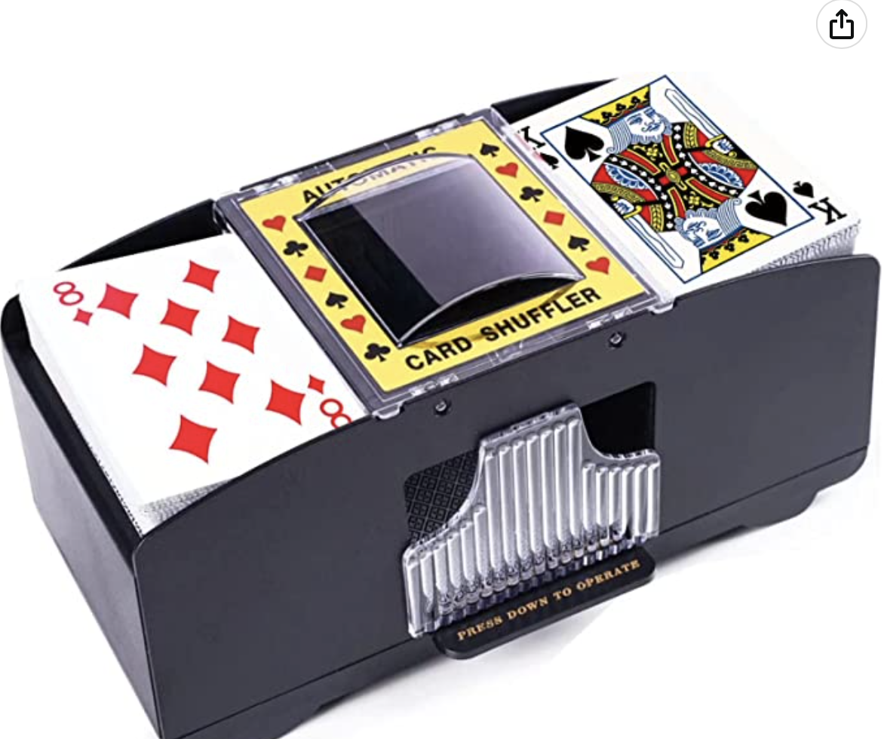

# 2/21/2023
# Objectives
- Meet with the machine shop again, give more ideas and explain to Gregg

Today, we met up with the machine shop to come up with a solution. After some discussion, we came to the conclusion that we could buy a standalone card shuffler to take it apart and use the enclosure (and motors that came with it). With this compromise, Greg felt more confident about being able to create the physical design we were asking for.

Here is a picture of the card shuffler enclosure we placed an order for through Amazon:

Essentially, they would attach this shuffler without the battery mount and everything on the bottom to the base they had given us earlier. and they would close off the hole in the front where the cards drop such that only a card can slide out. And they would card a small hole at the bottom of the portion of the shuffer with a lever arm sticking out attached to the motor we gave them (same as the design in our physical diagram).