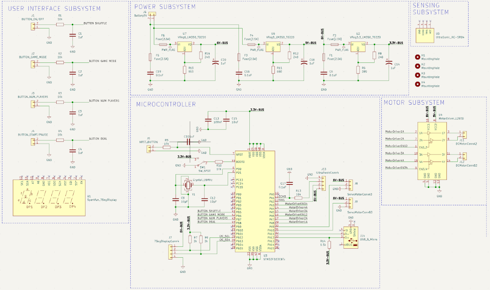

# 2/25/2023
# Objectives
- Worked on fixing schematic
- Worked on PCB

Today, we had to make some major adjustments after realizing that development boards were not acceptable under the microcontroller section of the ECE 445 webpage. Our schematic before today used the STM32F411RE dev board. We had to switch our design to use primarily the stm32 chip. We ended up choosing the STM32F103C8T6 microcontroller chip and made major adjustments to the schematic (mostly for the microcontroller connections – adding any neccesarry components – and some work on teh power subsystem).

Our updated schematic was as follows: 

Using information online, we added all the necessary components to make our microcontroller chip programable and functional (crystal oscillator, power line capacitors, micro usb connector, reset button, etc). Without the 3.3V and 5V power pins from the development board we were originally planning on using, we needed to add two voltage regulators to regulate from 6V to 5V to 3.3V such that we can sufficiently and properly power all of our subsystems and constituent components. 

After making these adjustments, we began working on the pcb design reorganizing all the components and wiring certain components together.