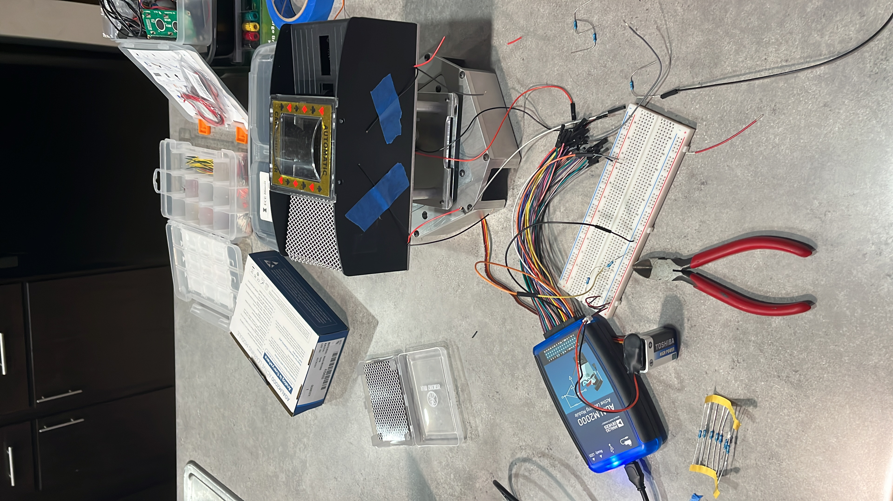

# 3/20/2023
# Objectives
- Fixed and finished the design review document

Today, we met up as a team after spring break and made minor adjustments to the design document to submit our revision. As olga said in our design review, our verification tables weren't specific to our project, so we simply reviewed all of our requirements, made necessary changes to them along with changes to the corresponding verifications.

