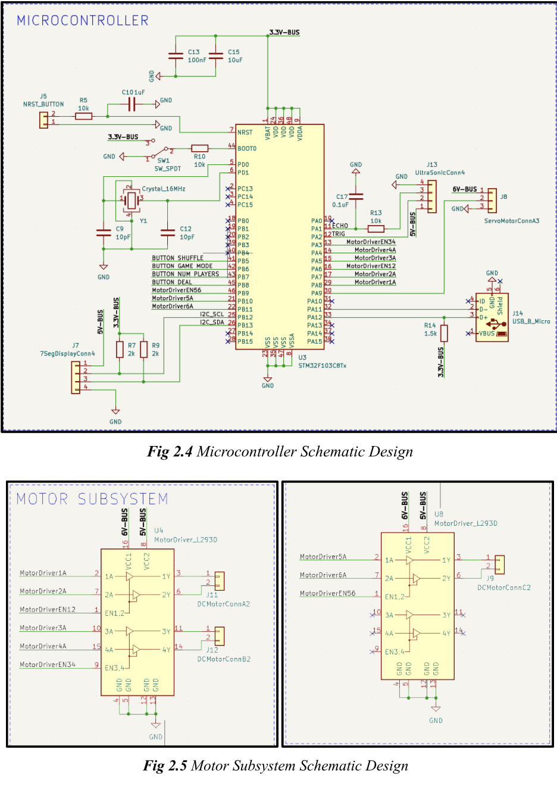

# 3/26/2023
# Objectives
- Began working on Individual Progress Reports

Today we all worked on our Individual Progress Reports. My report mainly focused on the motor subsystem as that was my focus. I wrote the introduction, design procedure and details, and refined the verification and tests table for the motor subsystem that we had in our design document. I discussed how the motor subsystem would be controlled through two motor drivers (L293D – one driver controlling the shuffling motors powered by 6V and the other controlling the single dc dealing motor) with the necessary pwm and direction gpio pins connected to it on the microcontroller along with another single pwm pin needed to control the servo (again 6V power needed). 

Here is a picture of the updated schematic (motor subsystem only):
