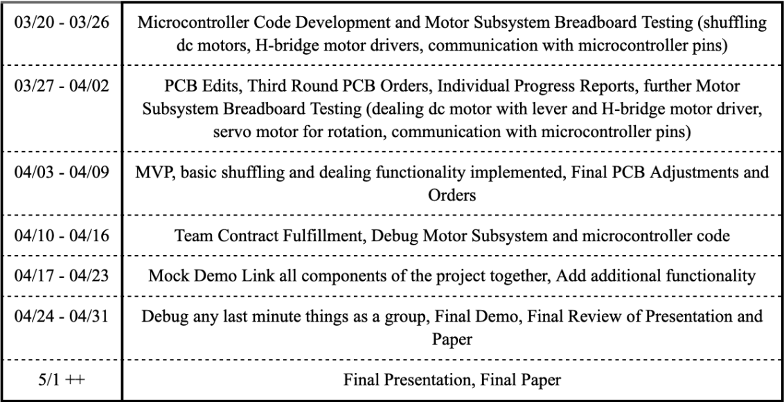

# 3/27/2023
# Objectives
- Continued working on Individual Progress Report

I split up the verification and testing into 4 main subsections: 1. microcontroller and motor driver testing 2. shuffling dc motor testing 3. dealing dc motor testing 4. rotating servo motor testing. 

1. Tests:
- microcontroller: PWM pins must be able to output a stable 0-100% duty cycle PWM wave.
- Motor Driver: Each input pin (1, 2EN, 3,4EN, 1A, 2A,  3A, 4A) must switch on and off when connected and given a logic high.
- Motor Driver: The Y1, Y2, Y3, and Y4 pins must be able to run a DC motor with the corresponding enable pin (1,2EN or 3,4EN)
- Microcontroller: Digital I/O pins for motor driver direction inputs must be able to output a stable 1 or 0 for proper directional control.

2. Tests:
- Shuffling DC motors must not be defective
- Shuffling DC motor must be able to output at least 40 oz-in of torque in order to shuffle a standard playing card.
- Shuffling DC motors must be able to shuffle a full deck of cards (place half the deck on each side of our system) in riffle fashion (one card from the left motor, next from the right) and mostly evenly.

3. Tests:
- Dealing DC Motor must not be defective
- Dealing DC motor needs at least 50 oz-in of torque in order to successfully launch a standard playing card (weighs roughly 100-150g) to a distance of 1 meter.
- Dealing DC motor must be able to shoot out 1 card at a time using the arm level attached to it and the pwm signals from the h-bridge motor driver

4. Tests:
- Rotation Servo Motor must not be defective
- Rotation servo motor must output enough torque (>80 oz-in) to rotate the device
- Must have the capability to rotate at least 180 in increments of 11.25, 12.9, 15, 18, 22.5, 30, 45, and 90 degrees (1-8 players) in a controlled manner.

Then I devised the following schedule for the rest of the semester:
