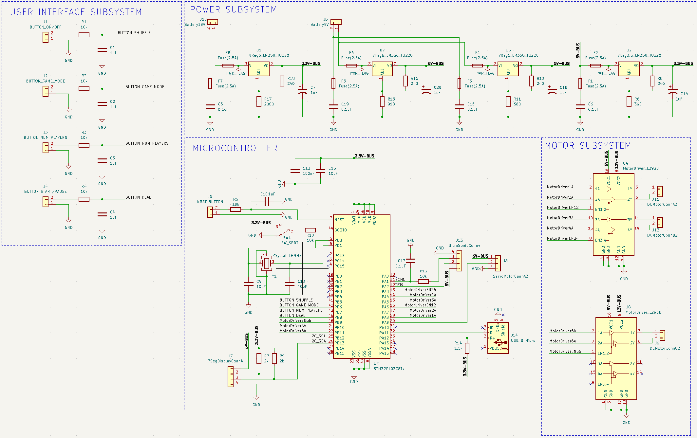

# 4/5/2023
# Objectives
- Testing PCB circuitry (motors) using STM Nucleo Dev Board

Today, we did some testing for our motor drivers. We wired up the motor drivers to the stm32 nucleo dev board and the motors on our shuffler/dealer (connecting the direction pins, pwm pins, and power pins with the outputs from the voltage regulators we wired up yesterday). We then programmed the pins through the stm32 ide and wrote a simple program to run the shuffling motors in the right direction. When running one motor individually, the 6V as an input to the motor driver was sufficient, however, with time the motor would slow down (quite quickly). And when we powered both of the shuffling motors at the same time (ideal scenario), the motors would run for a very short period of time. We realized that the motors we had consumed a bigger load than we thought and that we may need a larger voltage source. We did some testing trying to step down to different voltages from two 9V batteries in series instead. We tried 9V, 11V, etc. After some time, we found that 12V was a good amount without requiring too high of an input. We essentially ended up adding a voltage regulator to the power subsystem and used 2k ohm resistor to achieve a dropdown to roughly 12V. With making this change, we had to edit our schematic and update our pcb. When making these edits, we also noticed that we had not changed the dealing motor from a servo to a dc motor in our schematic/pcb. Thus, we needed another motor driver and had to adjust the pinout. 

After testing the shuffling motors, we also tested the dealing motor with some adjustments to the code (again used the motor driver with the same pins). Using the 6V as an input was more than sufficient (possibly because it is a better motor than the shuffling motors). So with our added motor driver, we have the 6V bus going to it for power.

Here is a picture of our updated schematic:

After making the updates to the schematic, we edited the pcb, and again sent the gerber files and drill files to Nikhil so he could place an order.