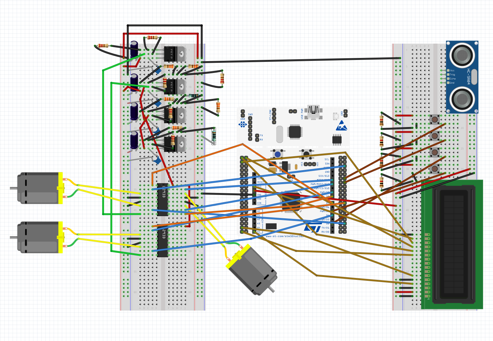

# 4/18/2023
# Objectives
- Work on display code and motor code

Today, we conitnued breadboarding the components (buttons, display). Originally, we were going to use the 7 segment display, but we had a 16x2 lcd screen display that would provide more complexity (display words instead of just numbers and give the user qeues whil using the device). I also spent some time creating a fritzing layout with the current wiring setup of the breadboard along with the dev board to make sure everything is reconstructable. Afterwards, I transferred the diy servo code to the actual servo. With testing, however, I found out that the servo given to us by the mechanical team was a 360 degree servo not made for precision and position control. Thus feeding in target angles through PWM and the typical servo motor frequency rating of 50 Hz (through timer channels on the microcontroller board modified to suit the typical 0.5ms-2.5ms pulse width range) was not an option with the given motor. The motor given to us was suited for 500µs-4000µs thus we had to make changes to the timer channel prescaler and counter period values and adjust them until we got somewhat precise control. 360-degree servo motors for reference are continuous and thus PWM inputs control the speed and direction of the motor rather than a target angle like 180-degree servo motors. With some testing of different timer channel settings, I was eventually able to get precise enough position control where the motor could turn the shuffler/dealer to following angles (verified using a protractor):

11.25° – Measurement: 11°
12.9° – Measurement: 13°
15° – Measurement: 16°
18° – Measurement: 18°
22.5° – Measurement: 22°
30° – Measurement: 30°
45° – Measurement: 46°
90° – Measurement: 90°

We also got the 16x2 display working with some research on how to use the digital pins instead of I2C and SPI which the hex display was originally supposed to use. We also got the buttons working to where clicking the first button would shuffle the cards and clicking the next button would deal the cards. The dealing wasn't great since we did not refine the spacing of the whole yet but it was functioning.

Here is a picture of the fritzing layout:
